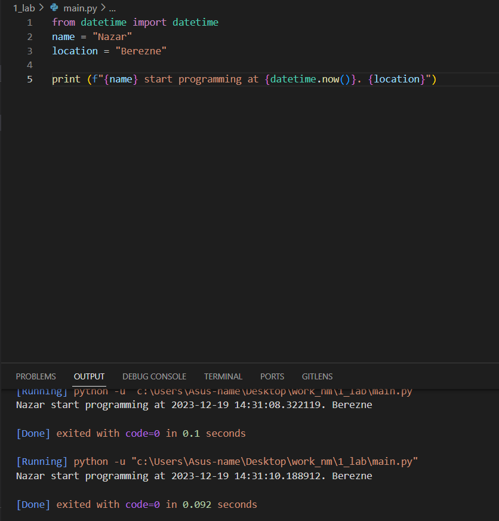

# Звіт до роботи №1
## Тема: Оформлення робіт та перша програма
## Мета робота: *Навчитися оформляти роботи з використанням форматування Markdown та створити першу проограму на Python;*

---

## Виконання роботи
- Результати виконання завдання:

    i. Створити [файл програми на Python](main.py);
    
    ii. Програма вивела текст програми представлений на скріншоті:
    

    iii. Стронено Jupyter Notebook, попрацював з різними комірками, написав пояснення до коду програми;
    
    iv. Результат виконання Jupyter Notebook знаходиться у файлі nb.ipynb;